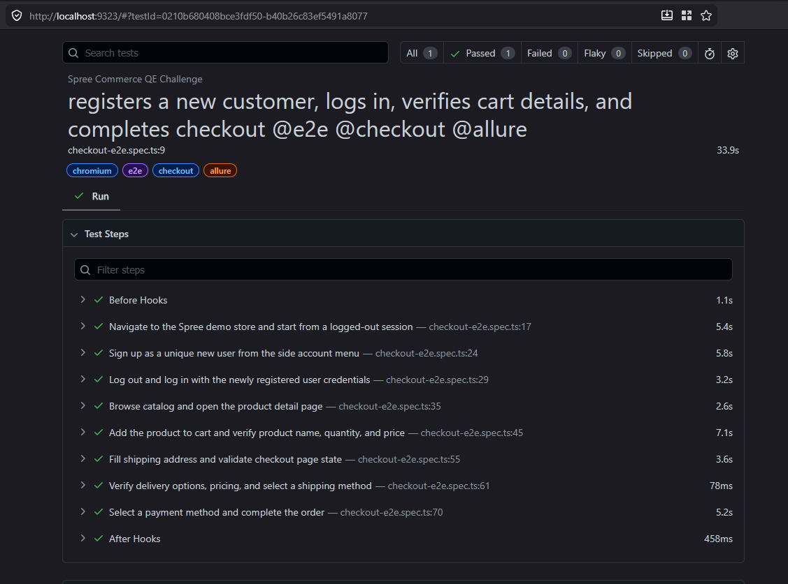
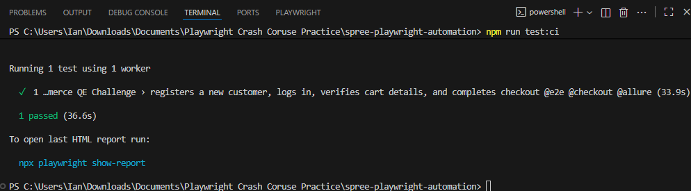
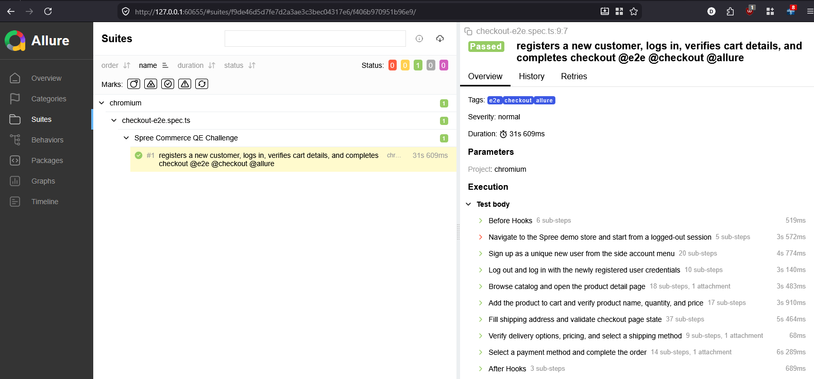

# Spree Playwright Automation

A GitHub-ready Playwright + TypeScript automation framework for the Spree Commerce demo store QE code challenge.

## What this covers

The main end-to-end test implements the requested Spree workflow:

1. Navigate to the Spree Commerce demo store.
2. Sign up as a unique new user from the account menu.
3. Log out and log back in with the newly registered credentials.
4. Browse products and open a product detail page.
5. Add a product to the cart.
6. Verify cart/checkout summary product name, quantity, price, and currency totals.
7. Fill shipping details, verify delivery options/prices, select shipping, select payment, and place the order.
8. Verify the confirmation page success message and dynamic order number.

## Tech stack

- Playwright Test
- TypeScript
- Page Object Model
- Allure reporting
- GitHub Actions CI

## Project structure

```text
.github/workflows/playwright.yml  # CI pipeline
pages/                          # Page objects
scripts/                        # Report utility scripts
tests/                          # Playwright specs
utils/                          # Test data and helpers
playwright.config.ts            # Playwright + Allure config
```

## Setup

```bash
npm ci
npx playwright install
```

By default, tests run against:

```text
https://demo.spreecommerce.org/us/en
```

Override the target URL when needed:

```bash
SPREE_BASE_URL=https://demo.spreecommerce.org/us/en npm test
```

## Run tests

```bash
npm test
npm run test:chromium
npm run test:headed
npm run test:debug
```

## Reports

Generate and open the Playwright HTML report:

```bash
npm run report
```

Generate and open Allure:

```bash
npm run allure:generate
npm run allure:open
```

Or serve raw Allure results directly:

```bash
npm run allure:serve
```
## Test Execution Evidence

The screenshots below show the latest successful local execution of the Playwright end-to-end checkout test using the Chromium project.

### Playwright HTML Report

This report shows the executed test case, test steps, runtime, and passed status from the Playwright HTML reporter.



### Terminal Test Run

This screenshot shows the command-line execution using the CI test script and confirms that the Chromium test passed successfully.



### Allure Report

This screenshot shows the generated Allure report with the Chromium suite, test status, tags, severity, parameters, and detailed execution steps.



## CI

The repository includes `.github/workflows/playwright.yml` with:

- dependency install via `npm ci`
- Chromium browser installation
- TypeScript validation
- Playwright execution
- Allure report generation
- artifact uploads for Playwright HTML, Allure report, and raw Allure results

The workflow runs on pushes, pull requests, and manual `workflow_dispatch` triggers.

## Notes for reviewers

- Runtime artifacts are excluded from Git through `.gitignore`.
- `allure-results`, `allure-report`, `playwright-report`, `test-results`, and `node_modules` should not be committed.
- Test data uses a timestamped email so the registration flow can run repeatedly against the public demo store.
- Assertions intentionally validate URL transitions, authentication state, product identity, quantity, price, delivery pricing, selected payment method, success messaging, and order number format.
